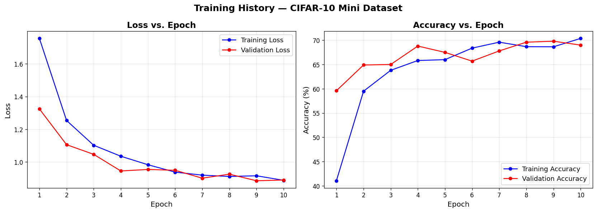
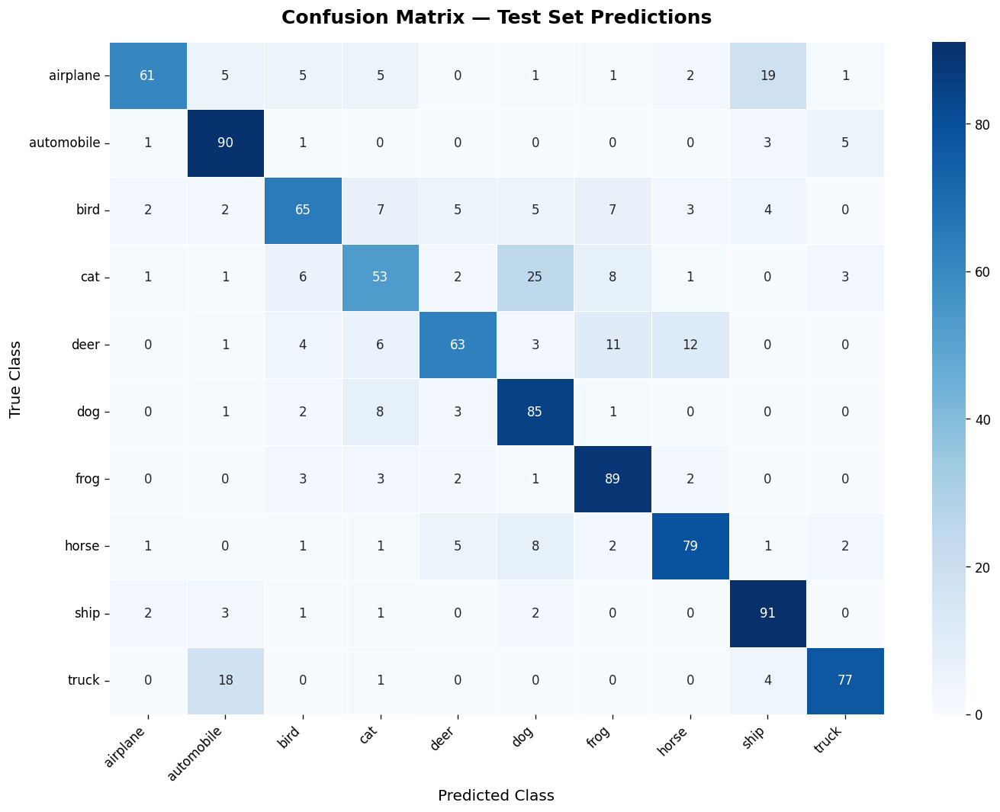

# computer-vision-cifar10-lab
# Computer Vision - CIFAR-10 Classification (Lab 11)

## Project Overview
Transfer learning using ResNet18 pretrained on ImageNet, 
fine-tuned on CIFAR-10 mini dataset (5000 images).

## Results
- Test Accuracy: XX.XX%   ← apna actual result yahan likhna
- Best Validation Accuracy: XX.XX%   ← apna result

## Dataset
- CIFAR-10 (10 classes, mini subset: 5000 training + 1000 test)
- Classes: airplane, automobile, bird, cat, deer, dog, frog, horse, ship, truck

## Model
- Architecture: ResNet18 (pretrained on ImageNet)
- Frozen layers: All except final FC layer
- Trainable parameters: 5,130 (out of 11M+)

## Training
- Epochs: 10
- Batch size: 32
- Optimizer: Adam (lr=0.001)
- Loss: CrossEntropyLoss

## Training Curves

## Confusion Matrix

